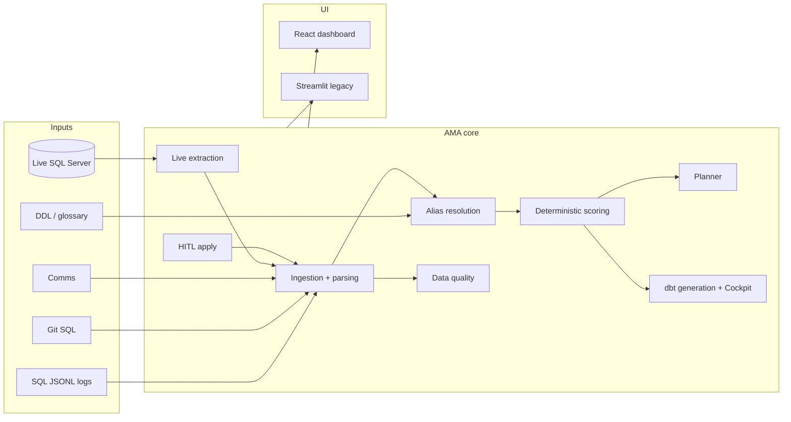

# AMA — User guide

**Audience:** data engineers and migration operators using AMA internally.  
**Developer setup:** see [README.md](README.md). **Live connection details:** [docs/LIVE_CONNECTION.md](docs/LIVE_CONNECTION.md). **dbt migration deep-dive:** [MIGRATION.md](MIGRATION.md).

---

## What AMA is

AMA (**Autonomous Migration Architect**) is an internal tool for **planning** legacy-to-cloud database migrations. It connects to real source systems (primarily SQL Server), extracts **metadata** (DDL and SQL activity), builds a scored migration inventory, and supports human-governed **dbt model generation**.

**What AMA does:** read-only source extract, scoring, wave planning, dbt `.sql` / `schema.yml` artifacts, and **local DuckDB validation** (stub sources + `dbt run`/`dbt test` on the dev machine).

**What AMA does not do:** bulk-copy production rows into a target warehouse. Real data cutover is a separate step — deploy the approved dbt project to your target platform and run your organization's load/replication strategy there.

The primary interface is the **React dashboard** (`http://localhost:3000` with Docker, or `http://localhost:5173` via `npm run dev` in `frontend/`). A legacy **Streamlit** dashboard (`ama-dashboard`) is still available for some workflows.

---

## Typical end-to-end workflow

```text
1. Live connection     → read-only extract from SQL Server → live_data/<name>/
2. Build AMA report    → optional during live ingest, or load existing JSON
3. Overview / Tables   → review scoring, lineage, per-table explain
4. Planner             → migration waves (business + technical rationale)
5. Bulk or Tables      → generate/approve dbt SQL (green queue first)
6. Mapping review    → resolve low-confidence alias mappings (inline on Glossary/Tables too)
7. Data Quality        → validate report shape before sign-off
8. DBT Cockpit         → batch-generate Checkpoint-A, review SQL, approve & write (optional dbt run)
9. Agent               → conversational migration assistant (optional)
```

Most pages require a **loaded report**. Use the **Load Report** bar at the top of the UI: paste the absolute path to a JSON report (e.g. `live_data/prod-crm/ama_live_report.json` on the host, or `/app/live_data/...` inside Docker) and click **Load**.

---

## React dashboard — navigation

| Page | Route | Purpose |
| --- | --- | --- |
| **Overview** | `/` | KPIs, impact vs readiness, links to Tables and Live connection |
| **Tables** | `/tables` | Scored inventory, lineage graph, propose/approve dbt models per table |
| **Live connection** | `/live` | Connect to SQL Server, run read-only extraction, build report |
| **Glossary** | `/glossary` | Business terms ↔ legacy/DDL columns with confidence |
| **Bulk** | `/bulk` | Batch-evaluate green tables, migration contract, WebSocket progress |
| **Planner** | `/planner` | Wave-by-wave migration plan from discovery inventory |
| **HITL** | `/hitl` | Column mapping review — approve/reject ambiguous legacy→DDL aliases |
| **Data Quality** | `/dq` | Report validation checks (shape, discovery, ingestion stats) |
| **DBT Cockpit** | `/cockpit` | Batch Checkpoint-A generation, review proposed SQL, approve & write/run dbt |
| **Agent** | `/agent` | Chat-driven migration agent with write-approval gate |

---

## Live connection

**Route:** `/live` · **API:** `POST /api/live/start` · **Docs:** [docs/LIVE_CONNECTION.md](docs/LIVE_CONNECTION.md)

Live connection performs **read-only** extraction against a real SQL Server database. AMA never deploys DDL/DML to the source.

### What it does

1. Validates the connection (ODBC / host+port+user+password).
2. Extracts **BASE TABLE** DDL from `INFORMATION_SCHEMA`.
3. Pulls SQL text from **Query Store** (fallback: plan cache), with literal redaction.
4. Writes artifacts under `live_data/<connection_name>/`:
   - `ddl/` — one JSON file per table (`{"columns": [...]}`)
   - `manifest.json` — table key → DDL path map
   - `sql_logs/prod.jsonl` — one JSON object per captured query
   - `ama_live_report.json` — optional, when **Build AMA report** is enabled

### UI workflow

1. Open **Live connection**.
2. Set **Dialect** to `sqlserver` (Oracle/DB2 connection test is supported; extraction is SQL Server only).
3. Enter a **Connection name** (folder name under `live_data/`, e.g. `prod-crm-01`).
4. Provide connection details (host/port/user/password/database) or paste a full ODBC connection string.
5. Choose schema scope:
   - **All user schemas** — entire database
   - Or comma-separated list (default `dbo`)
6. Optional: log date range and **Max log rows** (Query Store / plan cache).
7. **Test connection** → **Start ingestion** → watch WebSocket progress.
8. Enable **Build AMA report after export** to run discovery merge in-process.
9. Enable **auto-load** to open the report in **Tables** when ready.

### After extraction

Load the report from the top bar:

```text
live_data/<connection_name>/ama_live_report.json
```

On Docker, the host path is bind-mounted; inside the API container the same tree lives at `/app/live_data/<connection_name>/`.

### Security note

The live API accepts real credentials and has **no application-level auth** today. Run AMA only on a trusted internal network (VPN/firewall). See [README.md](README.md) Security & credentials.

### Local dev without a real DB

Use the **Kfar Supply** dev fixture: `python tools/setup_dev_mssql.py`, then point Live connection at the local `kfar_supply` database. See [docs/SQLSERVER.md](docs/SQLSERVER.md).

---

## Overview

**Route:** `/`

Summary dashboard for the loaded report:

- **Tables / Domains** stat cards
- **Impact Readiness** chart and table (confidence vs importance vs query volume)
- Alert with links to **Tables** (lineage graph) and **Live connection**

Use **Refresh Summary** after re-ingesting or applying HITL changes.

---

## Tables

**Route:** `/tables`

The main operational page for per-table migration work.

### Inventory grid

After loading a report, click **Evaluate** to score all tables. Each row shows:

| Field | Meaning |
| --- | --- |
| **Queue** | `green` (bulk-eligible), `yellow` (review), `red` (blocked/high criticality) |
| **Confidence** | Alias/DDL alignment score (0–100) |
| **Criticality** | Business impact score (0–100) — lineage, query volume, financial keywords |

Filter by domain, queue color, confidence/criticality thresholds, and search. **Hide migrated** hides tables you've already approved in this session.

Default bulk gate (also used on **Bulk** page): confidence ≥ 70 **and** criticality ≤ 40.

### Table lineage

Select a table to open the **Table lineage** graph (React Flow):

- **Solid edges** — DDL PK/FK relationships
- **Dashed edges** — SQL co-usage without a declared FK
- Node labels include per-table query counts; edges show shared-query counts

### Per-table migration (Propose → Approve)

In **Table Insights** for the selected table:

1. **Explain** — deterministic score breakdown (confidence + criticality reasons).
2. **Propose SQL** — LLM generates a dbt model + `schema.yml` for the table (cached per report/table/dialect).
3. **Approve & Migrate** — writes model files and runs local dbt validation. On **`approved`** only, records an audit decision and adds the table to the session migrated list.

**Approve response fields (when debugging):** `success`, `test_passed`, `status`, `stage1_error`, `stage2_error`, `passthrough_used`, and when degraded — `original_sql` / `final_sql`.

**Approve outcomes:**

| Status | Meaning |
| --- | --- |
| `approved` | Proposed SQL passed dbt validation; model written as-is |
| `degraded_passthrough` | Validation failed; model was replaced with `SELECT * FROM <table>` — **not** a full migration. Review `original_sql` vs `final_sql` in the UI warning |
| `failed` | dbt validation failed and no acceptable fallback |

Green tables with many dependents may link to **Bulk** for batch processing.

---

## Bulk migration

**Route:** `/bulk`

Batch path for **green-queue** tables that pass the confidence/criticality gate.

### Workflow

1. **Prepare / Evaluate** — scores all tables, shows migration **contract preview** (transformation rules for the batch).
2. Select tables (or **auto-select all green**).
3. Choose target **dialect** (`duckdb`, `snowflake`, `bigquery`, `redshift`).
4. **Start bulk job** — WebSocket-driven progress; success/failure per table.

Tables outside the DDL manifest scope are blocked (`outside_manifest_scope`). Red-queue tables are never bulk-approved automatically.

**Dry run** in the UI is informational only today — disable it to execute.

---

## Planner

**Route:** `/planner`

Builds **migration waves** from discovery inventory — same logic as `ama-ingest plan` on the CLI.

1. Click **Generate Plan** (runs wave planning + table evaluate in one step).
2. Expand each wave to see:
   - **Business rationale** and **Technical rationale** — formatted cards (bold labels, inline `table` names)
   - Per-wave queue summary chips (green / yellow / red)
   - **Tables in this wave** — searchable grid with queue chips and confidence/criticality

Use waves to sequence work: sources/staging before downstream marts. Cross-reference with **Tables** lineage before approving high-criticality objects.

---

## Glossary

**Route:** `/glossary`

Business glossary entries derived from logs, DDL, comms, and git SQL signals.

- Filter by **confidence minimum**, **portfolio**, **domain**, **status**
- Search and sort business terms
- Columns show legacy Hebrew/English aliases, target DDL names, source tables, confidence

Low-confidence mappings (especially transliteration fallbacks) should be reviewed in **HITL** before bulk cutover.

---

## Column mapping review (HITL)

**Route:** `/hitl` (nav: **Mapping review**)

When AMA parses SQL logs, ambiguous legacy → DDL column mappings land in **`review_candidates`**. The **Mapping review** page is the inbox for approving or rejecting them before bulk dbt generation.

**Sidecar storage:** decisions persist automatically. When the report lives in a **writable** path (e.g. `live_data/.../ama_live_report.json`), the sidecar is `<report>.hitl.json` next to it. When the report is **read-only** (Docker mounts `sample_data/` as `:ro`), decisions go to `live_data/.hitl/<report_id>.hitl.json` instead.

### Approve vs reject

| Action | Effect |
| --- | --- |
| **Approve** | Accept the suggested mapping — moves to **Merged**, used in scoring and dbt generation |
| **Reject** | Decline the suggestion — moves to **Rejected mappings**; the legacy column stays unresolved |

After **Reject**, re-run **Evaluate** on **Tables** (or **Generate Plan** on Planner). Affected tables get a `hitl_rejected_mapping` flag and typically move off **green** to **yellow (Review)** until you fix the column via glossary or manual SQL.

### What you see

| Bucket | Meaning |
| --- | --- |
| **Merged** | High-confidence mapping accepted into the report |
| **Pending review** | Ambiguous mapping — needs your decision |
| **Rejected mappings** | Human-declined suggestion — manual fix required (not “delete data”) |

### UI workflow (React)

1. Load a report — the page **auto-loads** the review queue.
2. For each row: **`legacy_name` → `suggested_ddl`** on **`source_table`**, with confidence and citation.
3. Click **Approve** or **Reject** — decision is saved and **applied to the in-memory report immediately**.
4. Use batch actions when many rows are pending: **Approve all ≥ 70%**, **Reject all < 40%**, or select rows and approve/reject in bulk.
5. Rejected rows appear under **Rejected mappings (manual fix required)** on the same page.

The same approve/reject controls appear on:

- **Glossary** — filter **Needs review**, act inline on each row
- **Tables** — unresolved/rejected mappings for the selected table, above **Propose SQL**
- **Overview / Bulk / Cockpit** — warning when pending or rejected mappings exist; Bulk and Cockpit require an acknowledge checkbox to continue with unresolved items

### API (for tooling)

- `GET /hitl/{report_id}/queue` — review inbox + `rejected_items` (`?source_table=` optional)
- `POST /hitl/{report_id}/decision` — one decision (`approved` | `rejected` | `clear`; `auto_apply` default `true`)
- `POST /hitl/{report_id}/decisions/batch` — batch by confidence filter or signature list
- `POST /hitl/{report_id}/apply` — re-apply all sidecar decisions (rarely needed from UI)

After resolving mappings, re-run **Evaluate** on **Tables** or **Generate Plan** on **Planner** to refresh queue assignments.

---

## Data Quality

**Route:** `/dq`

Runs the AMA data-quality suite on the loaded report (same checks as `ama-ingest dq` on the CLI).

1. Click **Run DQ Suite**.
2. Review checks grouped by severity: **ok**, **warn**, **error**.

Typical checks: schema version, discovery inventory non-empty, ingestion parse stats, alias merge consistency. Fix errors before treating the report as migration-ready.

---

## DBT Cockpit

**Route:** `/cockpit` · **API:** `POST /cockpit/{report_id}/checkpoint-a/start`

The Cockpit is the **scale path for batch model proposals**. When per-table **Propose/Approve** on **Tables** is too slow, Cockpit generates dbt SQL + `schema.yml` drafts for many tables in one async job and saves them as a **Checkpoint-A** artifact for human review.

**It is not an auto-migrator in the React UI.** The default **Start Job** button generates proposals only — it does not write `.sql` files to disk and does not run dbt.

### What happens when you click Start Job

1. AMA walks the **full table inventory** in the loaded report (all discovered tables, not just green queue).
2. For each table it runs the same generation pipeline as **Tables** / **Agent**: column resolution, glossary/alias mapping, LLM dbt SQL + schema YAML (with self-healing retries).
3. It bundles results into Checkpoint-A JSON:
   - `generated_models[]` — proposed SQL + schema per table
   - `mapping_rows[]` — alias decisions and warning flags
   - `review_required_tables[]` — broken lineage, transliteration warnings, low-confidence mappings
4. Saves under `dbt_project/target/checkpoints/jobs/<job_id>.checkpoint_a.json`.
5. The React page polls progress (auto every ~1.2s) and shows completed/total model counts.

Default API flags (what React sends today): `approve_checkpoint_a=false`, `run_execution=false`, no `wave_id_filter` → **generate for entire inventory, write nothing, run nothing**.

### Checkpoint-A vs execution

Checkpoint-A is a **mandatory review gate** before dbt files are executed:

- Surfaces generated SQL + schema YAML for every model in scope
- Flags **review_required** tables before you trust the batch
- Blocks disk writes and dbt runs until explicitly approved (API/CLI/Streamlit)

Wave-ordered **execution** (run dbt on wave 1, gate, then wave 2; Checkpoint-B fix loop; DLQ) happens when you check **Run dbt after writing files** in the React Cockpit UI, or pass `--approve-checkpoint-a --run-dbt` on the CLI.

Optional API field `wave_id_filter` limits generation to one planner wave; the React UI does not expose this — use CLI/API if you need wave-scoped generation.

### How Cockpit differs from Tables / Bulk

| Path | Scope | Writes files? | Runs dbt? |
| --- | --- | --- | --- |
| **Tables** | One table | On **Approve & Migrate** | Yes (validation test) |
| **Bulk** | Green-queue batch | Yes, during job | Yes (WebSocket progress) |
| **DBT Cockpit** (React default) | Full inventory | **No** — Checkpoint-A JSON only | **No** |

Use Cockpit when you want many draft models upfront for review. Use Tables/Bulk when you are ready to approve and execute.

### Reviewing and approving in the React UI

1. Load a report, then click **Generate Checkpoint-A**.
2. Expand each model in **Proposed models** to inspect SQL; flagged tables show a **review required** chip.
3. If any tables are flagged, check **I have reviewed flagged tables**.
4. Optionally check **Run dbt after writing files**.
5. Click **Approve & Write Files** (or **Approve & Run dbt**).

After approval, model files are written under `dbt_project/models/ama_generated/`. If dbt execution was requested, progress appears as **Execution: RUNNING** until finished.

**Local validation only:** when dbt runs from Cockpit (or Tables/Bulk), AMA bootstraps **empty stub tables** in `dbt_project/target/duckdb.db` so model SQL can compile and tests can run. Column lists are merged from report DDL, live extract JSON, `schema.yml`, and model SQL — stubs are never shrunk on re-bootstrap. This validates transformation logic locally; it does **not** load source production data.

**API:** `POST /cockpit/checkpoint-a/job/{job_id}/approve` with `{ "run_execution": false | true }`.

Alternative review paths:

The Cockpit API also supports (Streamlit-first or tooling today):

- Model risk analysis and scenario stress tests
- Synthetic data generation (gated, row-capped)
- SQL patch proposals from chat
- Checkpoint-B fix-loop for failed models

See [MIGRATION.md](MIGRATION.md) for Checkpoint-A/B JSON schemas, DLQ format, and wave gating rules.

### CLI equivalent

Replace the report path with your loaded JSON (dev fixture: `sample_data/kfar_supply/kfar_report.json`; live extract: `live_data/<connection_name>/ama_live_report.json`). On Windows PowerShell use **backticks** `` ` `` for line continuation — **not** `\`.

Generate proposals only (matches React **Start Job**):

```powershell
# PowerShell — one line
ama-ingest generate-dbt --report sample_data/kfar_supply/kfar_report.json --target-dialect duckdb --output-dir dbt_project/models/ama_generated --dbt-project-dir dbt_project
```

```bash
# Bash / Git Bash
ama-ingest generate-dbt \
  --report sample_data/kfar_supply/kfar_report.json \
  --target-dialect duckdb \
  --output-dir dbt_project/models/ama_generated \
  --dbt-project-dir dbt_project
```

After human review of the Checkpoint-A payload, approve and execute:

```powershell
# PowerShell — multiline (backtick at end of each line)
ama-ingest generate-dbt `
  --report sample_data/kfar_supply/kfar_report.json `
  --target-dialect duckdb `
  --output-dir dbt_project/models/ama_generated `
  --dbt-project-dir dbt_project `
  --approve-checkpoint-a `
  --run-dbt
```

```bash
# Bash / Git Bash
ama-ingest generate-dbt \
  --report sample_data/kfar_supply/kfar_report.json \
  --target-dialect duckdb \
  --output-dir dbt_project/models/ama_generated \
  --dbt-project-dir dbt_project \
  --approve-checkpoint-a \
  --run-dbt
```

Limit to one planner wave via API body field `wave_id_filter` (React UI does not expose this; CLI has `--bypass-wave` for execution gating only).

---

## Agent

**Route:** `/agent` · **API:** `POST /agent/{report_id}/turn`

A **chat-driven migration assistant** that uses tool calls against the loaded report: list waves, analyze schema, propose dbt models, run dbt tests, request write permission.

### How it works

- **Stateless mode:** the browser holds conversation state and sends it back on each turn (`state.messages`).
- The agent calls backend tools (Architect / Developer / QA roles) and returns structured output.
- **Pending Write Approval:** when the agent wants to write SQL to disk, it stops and shows an editable SQL + schema YAML panel. You must click **Approve & Write** or **Reject** — nothing is written without explicit approval.

### Example prompts

- `Show Status` — wave/table progress summary
- `Inspect dbo.orders and generate a model for DuckDB`
- `Migrate all tables in wave 1`

### Relationship to Tables page

| Feature | Tables page | Agent |
| --- | --- | --- |
| Propose SQL | One table, explicit button | Conversational, multi-step |
| Approve/write | **Approve & Migrate** with dbt test | **Approve & Write** gate in chat |
| Best for | Operator knows exact table | Exploratory / multi-table goals |

Both paths use the same underlying `propose_dbt_model`, `test_model`, and write gates.

---

## CLI reference (selected)

### Ingest → report

```bash
ama-ingest run --discovery-mode --format json -o report.json
```

With live-export artifacts:

```bash
ama-ingest run \
  --data-root live_data/prod-crm \
  --sql-logs live_data/prod-crm/sql_logs/prod.jsonl \
  --ddl-manifest live_data/prod-crm/manifest.json \
  --discovery-mode --format json \
  -o live_data/prod-crm/ama_live_report.json
```

### Data quality

```bash
ama-ingest dq --report report.json
```

### Migration plan

```bash
ama-ingest plan --report report.json
```

Requires `discovery.inventory` in the report (`--discovery-mode` during ingest).

### Log scan (telemetry)

```bash
ama-ingest log-scan path/to/logs.jsonl --max-records 5000
```

| Flag | Meaning |
| --- | --- |
| `--env prod` | Filter JSONL rows by `env` field |
| `--all-envs` | No env filter |
| `--max-records N` | Cap per file |
| `--progress` | Progress to stderr |

### Local smoke test

```bash
python demo_runner.py
python demo_runner.py --no-dashboard
```

Runs full discovery merge over the bundled dev fixture and optionally opens Streamlit.

---

## Legacy Streamlit dashboard

```bash
pip install -e .
ama-dashboard --report-path path/to/your_report.json
```

Opens at `http://localhost:8501`. Streamlit still includes richer Agent UX (wave tracker, mapping tables, fix-loop diffs). React covers day-to-day ops including Cockpit Checkpoint-A approve + optional dbt run; use Streamlit for deep Checkpoint-B fix-loop review when needed.

| Tab | Use |
| --- | --- |
| **Executive overview** | KPIs, impact vs readiness |
| **Domains** | Per-domain health |
| **Planner** | Migration waves |
| **Business Glossary** | Term ↔ column mappings |
| **Ask the data** | Concept search |
| **Tables** | Per-table detail + lineage |
| **Data quality** | DQ suite |
| **Review (HITL)** | Approve / reject mappings |
| **Migration Agent** | Full chat + checkpoint gates |

**Reload from Disk** (sidebar) refreshes JSON and HITL sidecar after engineering regenerates files.

---

## Architecture (summary)



| Layer | Role |
| --- | --- |
| **Live extraction** | Read-only SQL Server DDL + Query Store → `live_data/` |
| **Ingestion** | Parse SQL logs, build discovery inventory + lineage |
| **Alias resolution** | Hebrew ↔ English, glossary, fuzzy/phonetic tiers |
| **Scoring** | Deterministic confidence + criticality → green/yellow/red |
| **Planner** | Wave ordering from inventory + lineage |
| **HITL** | Human overrides persisted in sidecar (report-adjacent or `live_data/.hitl/`) |
| **dbt / Cockpit** | Model generation, Checkpoint-A/B, self-healing loop |
| **Agent** | LLM tool-use orchestration with write gate |

---

## FAQ

| Question | Answer |
| --- | --- |
| **Where do secrets go?** | `.env` or `AMA_*` environment variables. Never commit credentials. |
| **What is Rejected mappings?** | Human-declined alias suggestion — column stays unresolved; fix via glossary or model SQL, then re-evaluate. |
| **I rejected a mapping but the table still looks green?** | Re-run **Evaluate** on Tables. Rejected mappings add a review flag and move the table off green. |
| **Mapping review approve fails on Kfar fixture?** | `sample_data/` is read-only in Docker — decisions save to `live_data/.hitl/`. Rebuild API after updates: `docker compose up --build`. |
| **Empty mapping review queue?** | Many reports auto-classify everything as merged. Kfar has ~3 pending rows. Try `sample_data/dashboard/demo_with_review.json` for a minimal demo. |
| **No plan output?** | Ingest with `--discovery-mode` so `discovery.inventory` is populated. |
| **Empty SQL logs after live extract?** | Query Store may be empty — widen dates, run workloads, or seed with `tools/kfar_test_queries.sql` on dev DB. |
| **Approve showed degraded passthrough?** | Proposed SQL failed local dbt validation; a bare `SELECT *` was written instead. Review the warning on **Tables** — do not treat as a completed migration. |
| **Does AMA move production data?** | No. AMA extracts metadata, writes dbt models, and optionally runs dbt against local DuckDB stubs. Target warehouse loading is outside AMA. |
| **Cockpit dbt run failed on missing column?** | Usually a stub/bootstrap mismatch — restart the API after code updates (`docker compose up --build`), re-approve with **Run dbt** so stubs are rebuilt from merged DDL/schema columns. |
| **React vs Streamlit?** | React is the primary internal UI (including Cockpit approve); Streamlit retains fuller Agent / Checkpoint-B fix-loop UX. |
| **Report path in Docker?** | Kfar default: `/app/sample_data/kfar_supply/kfar_report.json` · Live extract: `/app/live_data/<name>/ama_live_report.json` · Host paths use `C:/...` |

---

## Related docs

- [README.md](README.md) — quickstart, architecture, internal use
- [docs/LIVE_CONNECTION.md](docs/LIVE_CONNECTION.md) — live API fields, artifact layout, troubleshooting
- [docs/SQLSERVER.md](docs/SQLSERVER.md) — ODBC setup, Docker networking, dev fixture
- [MIGRATION.md](MIGRATION.md) — Checkpoint-A/B, DLQ, wave gating, CLI `generate-dbt`

---

*AMA — Autonomous Migration Architect (internal)*
