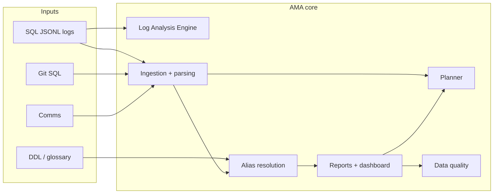

# AMA — User guide

**Audience:** business readers and technical operators. **Developer setup:** see **README.md**.

---

## What AMA is

AMA (**Autonomous Migration Architect**) helps teams **plan and govern** legacy-to-cloud moves using real **SQL activity**, **repo SQL**, and **comms**. You get **Excel** and/or **JSON** reports and an optional **browser dashboard**.

---

## High-level architecture




| Layer                                             | Meaning                                                                                                       |
| ------------------------------------------------- | ------------------------------------------------------------------------------------------------------------- |
| **Log Analysis Engine** (`ama.log_analysis`)      | Streams `**.jsonl`** logs, measures parse success (SQLGlot vs fallback) without loading whole files into RAM. |
| **Ingestion** (`ama.sql_pipeline`, `ama.parsing`) | Normalizes text, parses SQL, builds stats / optional lineage.                                                 |
| **Planner** (`ama.planner`)                        | Builds **migration waves** from **discovery inventory** (grouped by domain, priority-ordered). JSON includes short **business** and **technical** rationales per wave plus metrics. |
| **Data quality** (`ama.data_quality`)             | Checks report shape, schema version, ingestion stats, discovery consistency.                                  |
| **Security** (`ama.security`)                     | Redacts paths in logs; **never** put API keys in source — use `**.env`** / `AMA_*` only.                      |


---

## Install & launch dashboard

```bash
pip install -e .
ama-dashboard --report-path path/to/your_report.json
```

The browser opens (often `http://localhost:8501`). Use a real path to your `**.json**` file.

---

## Usage examples (CLI)

### 1) Full ingest → JSON report

```bash
ama-ingest run --format json -o report.json
```

With discovery + lineage (for planner + risk hotspots):

```bash
ama-ingest run --discovery-mode --format json -o report.json
```

### 2) Data quality (DQ) on a report

```bash
ama-ingest dq --report report.json
```

Exit code **0** if there are no **error**-severity checks; warnings may still print.

### 3) Migration plan (waves from inventory)

```bash
ama-ingest plan --report report.json
```

Requires **discovery inventory** in the report (use `**--discovery-mode`** when ingesting). Optional: `--max-tables-per-wave 25 --max-waves 20`. Each wave in the JSON lists tables plus **`business_rationale`**, **`technical_rationale`**, and compact **`metrics`** (priority scores are numeric, e.g. two decimal places in the text).

### 4) Log Analysis Engine (telemetry only)

Scan one or more SQL `**.jsonl**` files (streaming):

```bash
ama-ingest log-scan sample_data/sql_logs/full_db_chaos.jsonl --max-records 5000
```


| Flag              | Meaning                                                      |
| ----------------- | ------------------------------------------------------------ |
| `--env prod`      | Only rows whose JSON field `env` matches (default **prod**). |
| `--all-envs`      | Do not filter by `env`.                                      |
| `--max-records N` | Stop after **N** records **per file**.                       |
| `--progress`      | Print progress to stderr every `--progress-every` rows.      |


### 5) Stakeholder demo (`demo_runner.py`)

The **demo runner** is a scripted walkthrough for presentations: it runs the **same ingestion** as:

```bash
ama-ingest run --discovery-mode --discovery-merge-all --format json -o demo_report.json
```

(i.e. full discovery inventory, multi-table DDL merge via manifest, comms + Git signals, glossary, lineage, **`alias_merge`**, then a migration **plan** snapshot). It uses the **[Rich](https://github.com/Textualize/rich)** library for progress and a summary table, writes **`demo_report.json`** (override with **`--report-out`**), and can launch the **Streamlit** dashboard and open the browser.

```bash
pip install -e .
python demo_runner.py
python demo_runner.py --no-dashboard
python demo_runner.py --skip-vectors
python demo_runner.py --all-project-sql-logs
```

| Flag | Meaning |
|------|---------|
| `--no-dashboard` | Only generate the JSON + Rich output; do not start Streamlit |
| `--skip-vectors` | Faster run; skips building the comms/Git embedding index |
| `--all-project-sql-logs` | Use all `**/sql_logs/**/*.jsonl` under `--data-root` (slower, more tables) |
| `--sql-logs PATH ...` | Explicit JSONL files (default: `sample_data/sql_logs/sample_file.jsonl`) |
| `--discovery-merge-max N` | Cap how many tables get DDL merge (same as `ama-ingest`) |

---

## Log Analysis configuration (in code)

When calling `LogAnalysisEngine` from Python, use `**LogAnalysisConfig`**:


| Field                  | Role                                               |
| ---------------------- | -------------------------------------------------- |
| `env_filter`           | Match JSONL `env` (or `None` / empty = no filter). |
| `default_sql_dialect`  | Fallback dialect name if a row omits `dialect`.    |
| `max_records_per_file` | Cap records per file for quick scans.              |
| `progress_every`       | How often to log progress when `progress=True`.    |


---

## Dashboard (short)


| Tab                    | Use                                                                 |
| ---------------------- | ------------------------------------------------------------------- |
| **Executive overview** | KPIs, impact vs readiness, risk hotspots                          |
| **Domains**            | Per-domain health (inventory drill-down per domain)                |
| **Planner**            | Migration **waves** from discovery — same logic as **`ama-ingest plan`**, with short business/technical blurbs per wave |
| **Business Glossary**  | Business terms ↔ columns                                            |
| **Ask the data**       | Concept search                                                      |
| **Tables**             | Per-table detail + optional lineage graph                         |
| **Data quality**       | DQ suite results on the loaded report                             |
| **Review (HITL)**      | Approve / reject mappings                                           |


**Reload from Disk** (sidebar, path mode) refreshes JSON and HITL sidecar after engineering regenerates files.

---

## FAQ


| Question                 | Answer                                                                        |
| ------------------------ | ----------------------------------------------------------------------------- |
| **Where do secrets go?** | `**.env`** or environment variables (`AMA_*`). Never commit keys.             |
| **What is Trash?**       | Low-trust mapping — not “delete data.”                                        |
| **No plan output?**      | Run ingest with `**--discovery-mode`** so `discovery.inventory` is populated. |


---

*AMA — Autonomous Migration Architect*