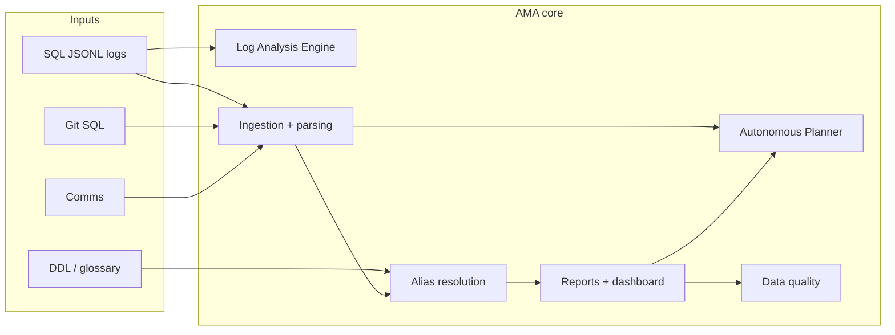

# AMA — User guide

**Audience:** business readers and technical operators. **Developer setup:** `**README.md`**.

---

## What AMA is

AMA (**Autonomous Migration Architect**) helps teams **plan and govern** legacy-to-cloud moves using real **SQL activity**, **repo SQL**, and **comms**. You get **Excel** and/or **JSON** reports and an optional **browser dashboard**.

---

## High-level architecture




| Layer                                             | Meaning                                                                                                       |
| ------------------------------------------------- | ------------------------------------------------------------------------------------------------------------- |
| **Log Analysis Engine** (`ama.log_analysis`)      | Streams `**.jsonl`** logs, measures parse success (SQLGlot vs fallback) without loading whole files into RAM. |
| **Ingestion** (`ama.sql_pipeline`, `ama.parsing`) | Normalizes text, parses SQL, builds stats / optional lineage.                                                 |
| **Autonomous Planner** (`ama.planner`)            | Builds **migration waves** from **discovery inventory** in a report (priority / domain).                      |
| **Data quality** (`ama.data_quality`)             | Checks report shape, schema version, ingestion stats, discovery consistency.                                  |
| **Security** (`ama.security`)                     | Redacts paths in logs; **never** put API keys in source — use `**.env`** / `AMA_*` only.                      |


---

## Install & launch dashboard

```bash
pip install -e .
ama-dashboard --report-path path/to/your_report.json
```

The browser opens (often `http://localhost:8501`). Use a real path to your `**.json**` file.

---

## Usage examples (CLI)

### 1) Full ingest → JSON report

```bash
ama-ingest run --format json -o report.json
```

With discovery + lineage (for planner + risk hotspots):

```bash
ama-ingest run --discovery-mode --format json -o report.json
```

### 2) Data quality (DQ) on a report

```bash
ama-ingest dq --report report.json
```

Exit code **0** if there are no **error**-severity checks; warnings may still print.

### 3) Migration plan (waves from inventory)

```bash
ama-ingest plan --report report.json
```

Requires **discovery inventory** in the report (use `**--discovery-mode`** when ingesting). Optional: `--max-tables-per-wave 25 --max-waves 20`.

### 4) Log Analysis Engine (telemetry only)

Scan one or more SQL `**.jsonl**` files (streaming):

```bash
ama-ingest log-scan sample_data/sql_logs/full_db_chaos.jsonl --max-records 5000
```


| Flag              | Meaning                                                      |
| ----------------- | ------------------------------------------------------------ |
| `--env prod`      | Only rows whose JSON field `env` matches (default **prod**). |
| `--all-envs`      | Do not filter by `env`.                                      |
| `--max-records N` | Stop after **N** records **per file**.                       |
| `--progress`      | Print progress to stderr every `--progress-every` rows.      |


---

## Log Analysis configuration (in code)

When calling `LogAnalysisEngine` from Python, use `**LogAnalysisConfig`**:


| Field                  | Role                                               |
| ---------------------- | -------------------------------------------------- |
| `env_filter`           | Match JSONL `env` (or `None` / empty = no filter). |
| `default_sql_dialect`  | Fallback dialect name if a row omits `dialect`.    |
| `max_records_per_file` | Cap records per file for quick scans.              |
| `progress_every`       | How often to log progress when `progress=True`.    |


---

## Dashboard (short)


| Tab                    | Use                                       |
| ---------------------- | ----------------------------------------- |
| **Executive overview** | KPIs, impact vs readiness, risk hotspots  |
| **Domains**            | Per-domain health                         |
| **Business Glossary**  | Business terms ↔ columns                  |
| **Ask the data**       | Concept search                            |
| **Tables**             | Per-table detail + optional lineage graph |
| **Review (HITL)**      | Approve / reject mappings                 |


**Reload from Disk** (sidebar, path mode) refreshes JSON and HITL sidecar after engineering regenerates files.

---

## FAQ


| Question                 | Answer                                                                        |
| ------------------------ | ----------------------------------------------------------------------------- |
| **Where do secrets go?** | `**.env`** or environment variables (`AMA_*`). Never commit keys.             |
| **What is Trash?**       | Low-trust mapping — not “delete data.”                                        |
| **No plan output?**      | Run ingest with `**--discovery-mode`** so `discovery.inventory` is populated. |


---

*AMA — Autonomous Migration Architect*